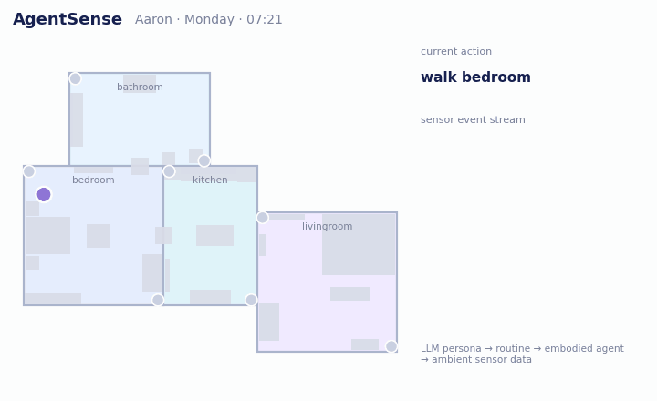
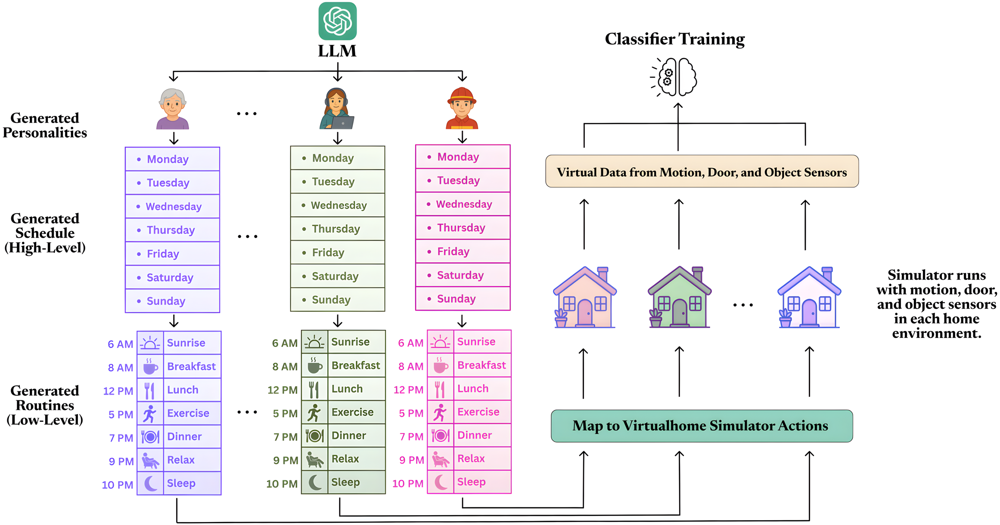
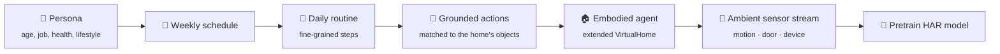

<div align="center">


# AgentSense

### Virtual Sensor Data Generation Using LLM Agents in Simulated Home Environments

**[Zikang Leng](https://zikangleng.github.io/)\*, Megha Thukral\*, Yaqi Liu\*, Hrudhai Rajasekhar, Shruthi K. Hiremath, Jiaman He, [Thomas Plötz](https://ploetzlab.net/)**
<br>Georgia Institute of Technology · \*equal contribution

**AAAI 2026**

[](https://zikangleng.github.io/agentsense/)
[](https://ojs.aaai.org/index.php/AAAI/article/view/37169)
[](https://arxiv.org/abs/2506.11773)
[](LICENSE)



<sub>A generated day from the paper: persona "Aaron" in home 0 on Monday morning. The agent follows its LLM-written routine, motion sensors light up when it is in range, and the resulting sensor event stream is what activity-recognition models are trained on.</sub>

</div>

**Smart-home activity recognition is starved for labelled data.** Every home has a different layout, different sensors and a different resident. AgentSense generates that data instead of collecting it:
1. An LLM writes diverse personas and their daily routines.
2. Embodied agents live out those routines in an extended VirtualHome simulator instrumented with ambient sensors.
3. The result is labelled, privacy-preserving smart-home sensor data at scale.

<table align="center">
<tr>
<td align="center"><b>18</b><br>LLM-generated personas</td>
<td align="center"><b>22</b><br>simulated homes</td>
<td align="center"><b>250</b><br>simulated days</td>
<td align="center"><b>5</b><br>real smart-home datasets improved</td>
</tr>
</table>

## How it works





1. **Personas.** An LLM generates residents with distinct ages, occupations, health conditions and habits.
2. **Schedules and routines.** Each persona gets a weekly schedule, which is expanded into step-by-step daily routines.
3. **Grounding.** Every step is mapped to the simulator's action set and to objects that actually exist in the chosen home, using embedding search with similarity thresholds.
4. **Simulation.** Agents execute the routines in an extended VirtualHome. Every room has motion sensors, and door and device sensors are derived from the environment graph.
5. **Pretraining.** The virtual sensor data pretrains activity-recognition models, which are then fine-tuned on real homes.

## Results

Pretraining on AgentSense data and then fine-tuning on real data improves macro F1 on all five real datasets (TDOST-Basic + Bi-LSTM, mean of 3 folds):

| | Aruba | Milan | Cairo | Kyoto7 | Orange4Home |
|---|:---:|:---:|:---:|:---:|:---:|
| Real only | 63.98 | 70.81 | 51.51 | 52.48 | 21.56 |
| **Real + AgentSense** | **72.20** | **74.44** | **62.47** | **56.07** | **41.83** |

The gains are largest when real data is scarce.
- The [paper](https://arxiv.org/abs/2506.11773) also reports accuracy, weighted F1, the temporal model, and the low-data and diversity ablations.
- The [project page](https://zikangleng.github.io/agentsense/) has interactive visualisations.

## Repository structure

| Directory | Description |
| :--- | :--- |
| [**`AgentSense_pipeline/`**](./AgentSense_pipeline/) | LLM-based generation of personas, schedules and activity scripts (steps 1–9 and 11). |
| [**`VirtualHome_API/`**](./VirtualHome_API/) | Modified VirtualHome simulator for script execution and sensor data collection (step 10). |

## Getting started

1. **LLM pipeline**
   - Go to `AgentSense_pipeline/` and run the notebooks in order (step 1 to step 9).
   - [Detailed guide](./AgentSense_pipeline/AgentSense%20Generating%20Daily%20Household%20Activity%20Scr%202d7d5ba10f4080ad8983f8f3e867e90f.md)
2. **Simulator**
   - Go to `VirtualHome_API/`.
   - Download the Unity simulator from [Google Drive](https://drive.google.com/file/d/1HyOcPDV6_eLiwbCfMTYrj98he2Sqa5Fs/view?usp=sharing) and extract it into `VirtualHome_API/exe/`.
   - Set up the environment and run the simulation (step 10).
   - [Detailed guide](./VirtualHome_API/AgentSense%20Server%20Environment%20Setup%20and%20Synthetic%20%202d6d5ba10f4080939e12ef9eff360f2d.md)

## News

- **[Jan 2026]** Initial release of the AgentSense pipeline and simulation environment.
- **[Nov 2025]** AgentSense is accepted to **AAAI 2026**.
- **[Jun 2025]** Paper available on [arXiv](https://arxiv.org/abs/2506.11773).

## Citation

If you use AgentSense in your research, please cite:

```bibtex
@inproceedings{leng2026agentsense,
  title     = {AgentSense: Virtual Sensor Data Generation Using LLM Agents in Simulated Home Environments},
  author    = {Leng, Zikang and Thukral, Megha and Liu, Yaqi and Rajasekhar, Hrudhai and Hiremath, Shruthi K. and He, Jiaman and Pl{\"o}tz, Thomas},
  booktitle = {Proceedings of the AAAI Conference on Artificial Intelligence},
  volume    = {40},
  number    = {3},
  pages     = {1891--1899},
  year      = {2026}
}
```

## Acknowledgements

AgentSense builds on [VirtualHome](http://virtual-home.org/). We thank its authors for releasing the simulator.

## License

Released under the [MIT License](LICENSE).
